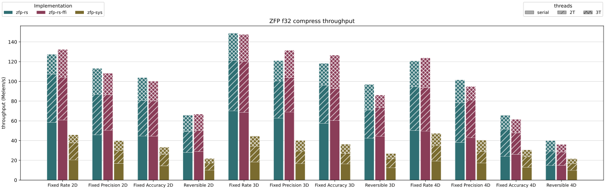
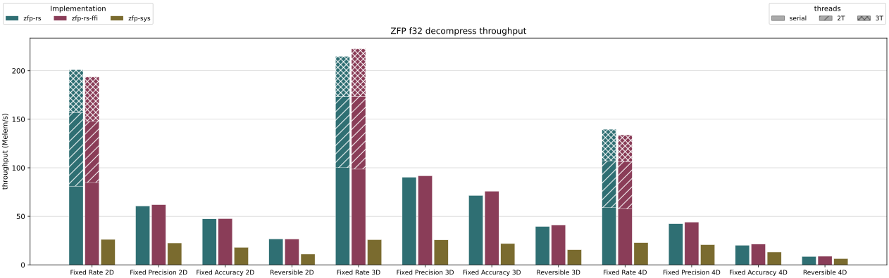

# `zfp-rs`: A pure-Rust implementation of the ZFP compression algorithm

Pure-Rust implementation of [ZFP](https://github.com/llnl/zfp) — a compression algorithm for compressed floating-point and integer arrays.
Produces bit-for-bit identical compressed output to the original C implementation.





## Differences from the C implementation

`zfp-rs` is a ground-up Rust rewrite, not a binding or wrapper.
Where it differs:

- **Idiomatic and Safe API**: Safe public API with lifetime-checked borrows.
- **Performance**: 2–4x faster than the serial C reference across all modes and types.
- **Parallel compression and fixed-rate decompression**: With the `rayon` feature, compression can be parallelized across all modes.
  Fixed-rate decompression is parallelized via per-thread bitstream seeking.
  The C library does not parallelize decompression.
- **Zero-C dependency chain**: No C compiler and no pkg-config.

## `zfp-rs-ffi`: drop-in replacement for `zfp-sys` and the `zfp` C library

The `zfp-rs-ffi` crate provides a C-compatible ABI mirroring [`zfp-sys`](https://docs.rs/zfp-sys/0.4.3/zfp_sys/).
`zfp-rs-ffi` can be used as a drop-in replacement for the `zfp-sys` in Rust projects:

```toml
zfp-sys = { package = "zfp-rs-ffi", version = "0.1" }
```

## Acknowledgement

This implementation is based on [zfp](https://github.com/LLNL/zfp).
The algorithm is described in the [`zfp` documentation](https://zfp.readthedocs.io/en/latest/algorithm.html) and in the following paper:

* James Diffenderfer, Alyson Fox, Jeffrey Hittinger, Geoffrey Sanders, Peter Lindstrom.
  [Error Analysis of ZFP Compression for Floating-Point Data](https://www.researchgate.net/publication/324908266_Error_Analysis_of_ZFP_Compression_for_Floating-Point_Data).
  SIAM Journal on Scientific Computing, 41(3):A1867-A1898, June 2019.
  [doi:10.1137/18M1168832](http://doi.org/10.1137/18M1168832).